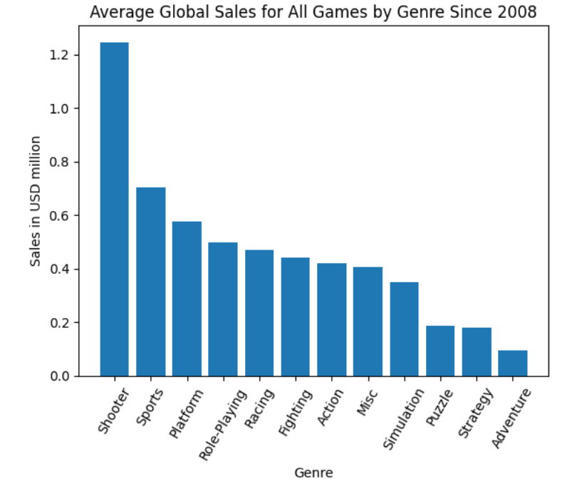
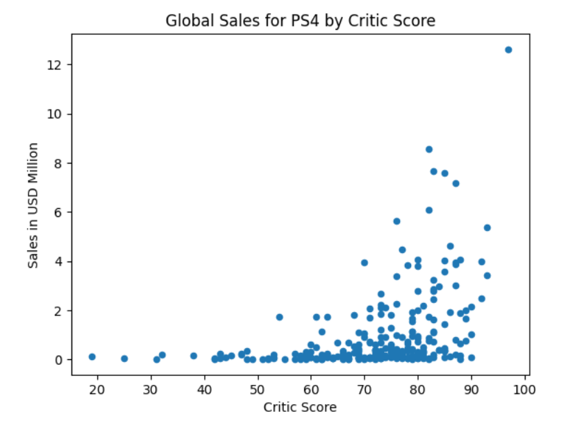

# Sprint 5 Project: Integrated Project 1

---

### 📚 Table of Contents
- 🔍 [Project Overview](#project-overview)
- 📈 [Conclusion](#conclusion)
- 🖼️ [Sample Outputs](#sample-outputs)
- 📁 [Files](#files)

---

## Project Overview

You work for the online store Ice, which sells video games all over the world. User and expert reviews, genres, platforms (e.g. Xbox or PlayStation), and historical data on game sales are available from open sources. You need to identify patterns that determine whether a game succeeds or not. This will allow you to spot potential big winners and plan advertising campaigns.

In front of you is data going back to 2016. Let’s imagine that it’s December 2016 and you’re planning a campaign for 2017.

The important thing is to get experience working with data. It doesn't really matter whether you're forecasting 2017 sales based on data from 2016 or 2027 sales based on data from 2026.

The dataset contains the abbreviation ESRB. The Entertainment Software Rating Board evaluates a game's content and assigns an age rating such as Teen or Mature.

---

## Conclusion

I began by preparing the data, making a few formatting adjustments, and investigating missing values. I found a large segment of data (6,621 rows) simultaneously missing values in the critic_score, user_score, and rating columns. Besides selling well only in Japan, nothing obviously distinguishes those rows from the rest. My best guess is that the critic_score, user_score, and rating columns came from a smaller dataset separate from the rest of the columns, maybe one that excluded certain Japanese games. There are also 2,424 rows with "tbd" for user_score. They tend to be poor-selling games predominantly made by Nintendo, marketed for kids, and low in violence. Without a good explanation for them, I treated them like other missing data.

Several columns have relatively small numbers of additional missing values (2 for name, 2 for genre, 80 for user_score, 145 for rating, 269 for year_of_release, and 1,957 for critic_score) that show no obvious patterns. I tried to use all the data available but no more, neither deleting nor arbitrarily filling missing values. I replaced NaN values in the rating column with "unknown" to track those in later analyses. The lifetime of a top-selling platform is less than a decade (9.6 years) and the best sellers in the full dataset (PS3 and X360) are quite old. In estimating 2017 sales, I tried to exclude obsolete trends by dropping data from before 2013.

The best-selling platforms in recent years were PS4 and XOne. Global sales was declining for every platform in 2016, but PS4, 3DS, WiiU, and XOne had strong sales while Wii, X360, PC, PS3, and PSV were rapidly dwindling. Reviews are significantly correlated with global sales for top-selling games, with critic score consistently a better predictor than user score. Shooter games make the most money on average, Action games sell the most overall because there are so many, Platform games are lucrative but rare, and Sports games are a good middle ground with solid margins and volume. Simulation, Strategy, and Puzzle games, on the other hand, are all poor sellers.

I created profiles for the North American, European, and Japanese markets. Whereas North America prefers Microsoft consoles and Europe prefers Sony consoles, Japan prefers portable Nintendo platforms more and Microsoft less than the rest. Every region enjoys Action games, but North America and Europe also like Shooter games while Japan prefers Role-Playing games. Games rated M (Mature) are the best sellers in North America and Europe but unknown ratings dominate Japan where a different rating system prevails.

Statistical tests reveal that user scores are significantly higher for Action than Sports genres but not significantly different for XOne and PC platforms.

The purpose of this project is to determine what would make a game sell well in 2017 according to indicators in the dataset and I came to a few potentially useful conclusions. Although the heyday of massive PS3 and X360 sales has passed, the current generation (PS4, 3DS, WiiU, and XOne) is still going strong. Advertising should focus on those newer platforms and the Shooter, Sports, and Platform genres while minimizing the Simulation, Strategy, and Puzzle genres. They should also prioritize games with high critic scores, maybe even including the scores in ads in case the effect is causal. Advertising should emphasize Microsoft, Shooter, and rated-M games in in North America; Sony, Shooter, and rated-M games in Europe; and portable Nintendo and Role-Playing games in Japan.

---

## Sample Outputs

Here are two key moments from the analysis:

  
*Average global sales by genre since 2008, showing strong dominance by shooter and sports games.*

 

  
*Relationship between critic scores and global sales for PS4 games — higher-rated games tend to sell more.*

---

## Files

📄 See the full analysis in [`sprint-05-project.ipynb`](./sprint-05-project.ipynb)  
📄 Or view a static version in [`sprint-05-project.html`](./sprint-05-project.html)  
📄 Project background: [`project-description.md`](./project-description.md)

> Note: This project uses one CSV file, which is included in the `/data/` folder.  
> See [`/data/README.md`](./data/README.md) for details.
